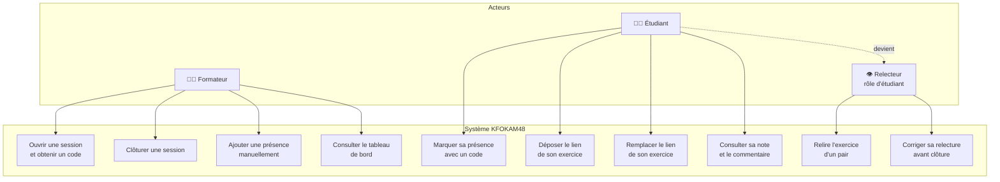

# D1 — Diagramme de cas d'utilisation

**Objectif :** montrer les acteurs du système et ce que chacun peut faire.

**Légende :**
- `F` = Formateur (acteur principal)
- `E` = Étudiant (acteur principal)
- `R` = Relecteur (rôle, pas un acteur distinct — voir section 2 du cahier des charges)
- La flèche pointillée `E -.-> R` indique qu'un étudiant devient relecteur par assignation automatique (RG7).