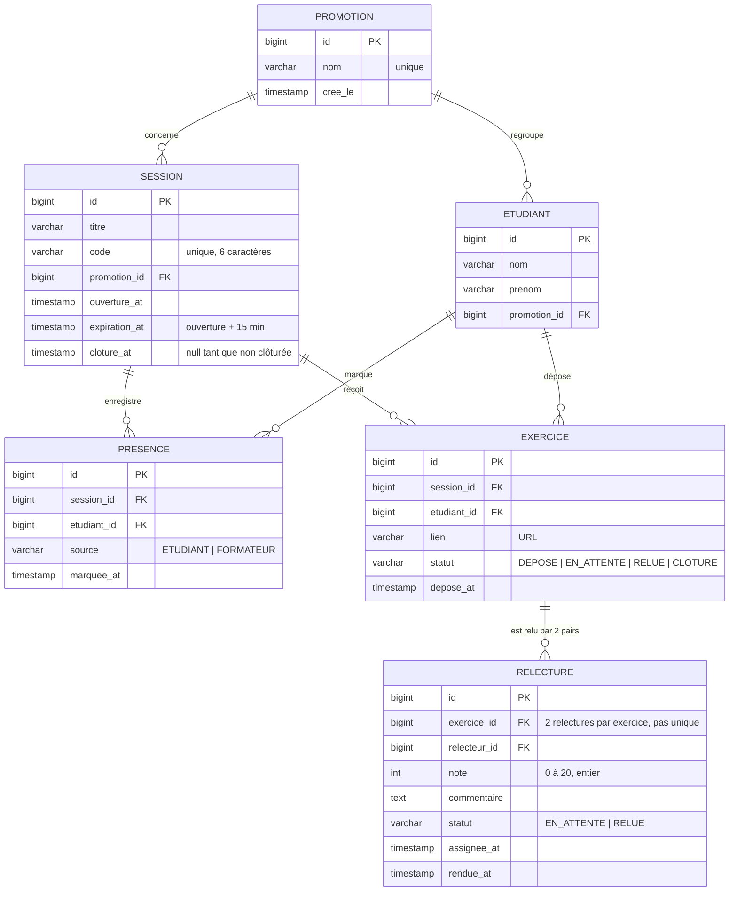

# D2 — Modèle de données

**Objectif :** décrire les entités, leurs attributs et leurs cardinalités. Ce diagramme doit correspondre aux migrations Flyway de l'étape 2.

**Contraintes à implémenter dans les migrations Flyway :**

| Table | Contrainte | Règle |
|---|---|---|
| `PRESENCE` | `UNIQUE (session_id, etudiant_id)` | RG4 — une seule présence par session |
| `EXERCICE` | `UNIQUE (session_id, etudiant_id)` | RG5 — un seul exercice par session |
| `RELECTURE` | `UNIQUE (exercice_id)` | RG6 — un seul relecteur par exercice |
| `RELECTURE` | `CHECK (note BETWEEN 0 AND 20)` | RG3 — note entière 0-20 |
| `RELECTURE` | `CHECK (relecteur_id <> (SELECT etudiant_id FROM EXERCICE WHERE id = exercice_id))` | RG2 — pas d'auto-relecture (vérifié en service) |
| `SESSION` | `code` unique | RG1 — un code actif à la fois |
| `SESSION` | `expiration_at = ouverture_at + 15 min` | RG1 — calculé en service |

**Statuts des entités :**

- **`EXERCICE.statut`** : `DEPOSE` → `EN_ATTENTE` → `RELUE` → `CLOTURE`
  - `DEPOSE` : lien soumis, relecteur pas encore assigné
  - `EN_ATTENTE` : relecteur assigné, note pas encore rendue (Q11)
  - `RELUE` : note et commentaire rendus
  - `CLOTURE` : la session a été clôturée par le formateur
- **`RELECTURE.statut`** : `EN_ATTENTE` → `RELUE`
  - `EN_ATTENTE` : assignée, pas encore rendue
  - `RELUE` : note et commentaire rendus