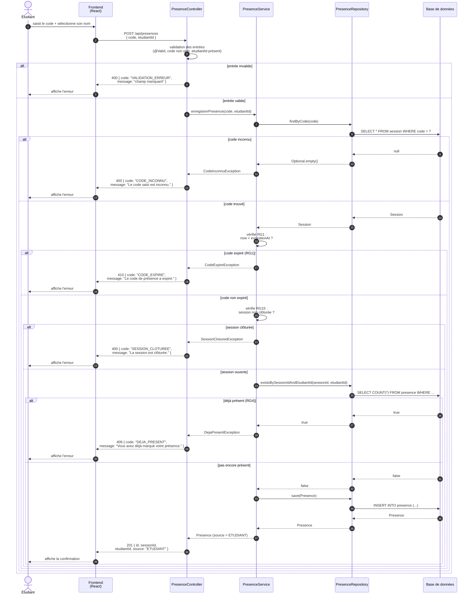

# D3 — Séquence : « marquer sa présence »

**Objectif :** décrire le cas nominal et au moins deux cas d'erreur. Ce diagramme doit correspondre aux codes HTTP du contrat `api/contrat.yaml`.

**Correspondance avec le contrat :**

| Cas | Code HTTP | Code erreur |
|---|---|---|
| Succès | `201` | — |
| Entrée invalide | `400` | `VALIDATION_ERREUR` |
| Code inconnu | `400` | `CODE_INCONNU` |
| Code expiré | `410` | `CODE_EXPIRE` |
| Déjà présent | `409` | `DEJA_PRESENT` |
| Session clôturée | `400` | `SESSION_CLOTUREE` |

**Règles de gestion couvertes :**
- RG1 : expiration 15 min
- RG4 : unicité de la présence par session
- RG15 : pas de présence après clôture