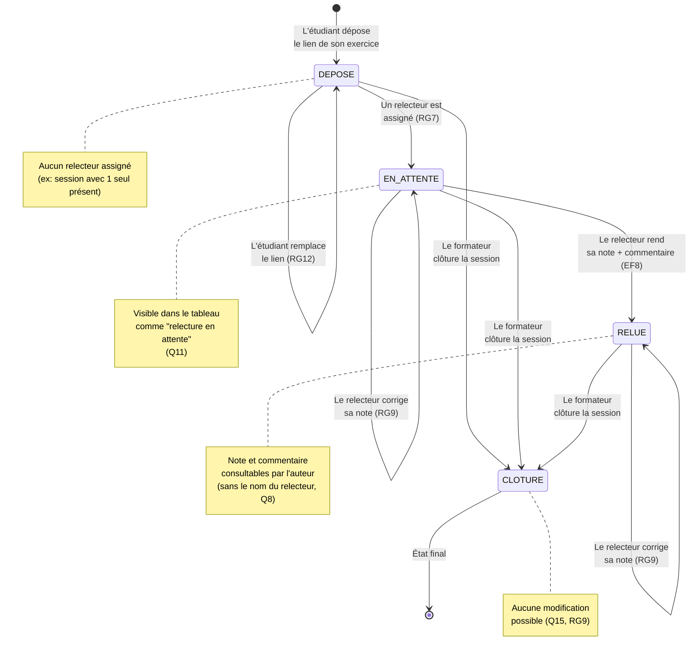

# D4 — États-transitions : cycle de vie d'un exercice *(bonus)*

**Objectif :** décrire les états d'un exercice et les transitions possibles, en cohérence avec Q11, Q12, Q13, Q10.

**Transitions autorisées :**

| De | Vers | Déclencheur | Règle |
|---|---|---|---|
| `[*]` | `DEPOSE` | Dépôt du lien | EF5, RG11 |
| `DEPOSE` | `EN_ATTENTE` | Assignation d'un relecteur | RG7, EF7 |
| `DEPOSE` | `DEPOSE` | Remplacement du lien | RG12, EF6 |
| `EN_ATTENTE` | `RELUE` | Relecture rendue | EF8 |
| `EN_ATTENTE` | `EN_ATTENTE` | Correction de la note | RG9, EF9 |
| `RELUE` | `RELUE` | Correction de la note | RG9, EF9 |
| `*` (sauf `CLOTURE`) | `CLOTURE` | Clôture de la session | EF2, RG15 |
| `CLOTURE` | `[*]` | État final | — |

**États interdits :**
- Pas de retour de `CLOTURE` vers un autre état (RG15)
- Pas de passage direct de `DEPOSE` à `RELUE` sans assignation de relecteur
- Pas de passage de `RELUE` à `DEPOSE` (Q13 : remplacement impossible une fois la relecture commencée)